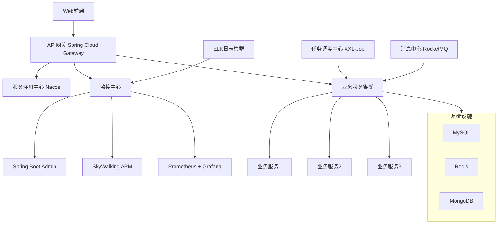
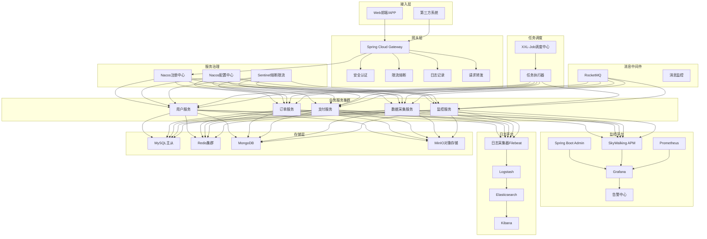
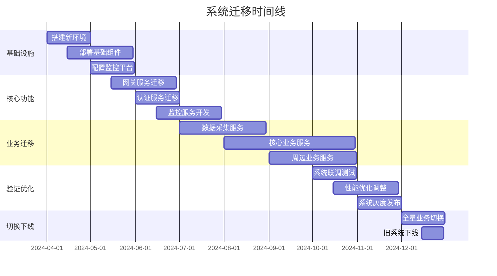

我来帮你分析问题并提供解决方案。让我们分类处理这些挑战：

1. 系统架构和模块化问题
- 现状：代码模块分散，第三方接口调用零散，业务逻辑不集中
- 解决方案：
```
- 采用微服务架构，按业务域拆分服务
- 使用Spring Cloud Alibaba套件
- 引入服务注册中心(Nacos)管理服务发现
- 实现API网关(Spring Cloud Gateway)统一接口管理
- 采用DDD领域驱动设计重构业务模块
```

2. 接口管理和监控
- 现状：接口分散，缺乏统一管理，版本控制和监控不足
- 解决方案：
```
- 引入Swagger/OpenAPI做接口文档
- 使用Spring Boot Admin + Actuator监控服务状态
- 采用SkyWalking做分布式链路追踪
- 实现统一接口版本管理机制
- 建立接口健康检查机制
```

3. 日志管理和问题定位
- 现状：日志分散，问题定位困难
- 解决方案：
```
- 引入ELK(Elasticsearch + Logstash + Kibana)统一日志收集
- 使用Sleuth做链路追踪
- 实现统一日志格式和级别管理
- 建立日志告警机制
- 集成Prometheus + Grafana做监控图表
```

4. 业务流程和文档管理
- 现状：业务文档不完整，代码与业务对应关系不清晰
- 解决方案：
```
- 引入GitBook做文档管理
- 使用PlantUML绘制业务流程图
- 建立统一的业务规则文档库
- 实现代码与业务的映射关系文档
```

5. 数据采集和处理
- 现状：数据刷新机制不完善，缺乏进度管理
- 解决方案：
```
- 使用Spring Batch处理批量任务
- 引入XXL-Job做分布式任务调度
- 实现数据处理进度看板
- 建立数据验证机制
```

技术栈选型建议：




迁移策略建议：

1. 第一阶段：基础设施搭建
```
- 搭建新的Spring Boot 3.2.9基础环境
- 实现服务注册中心和配置中心
- 搭建监控平台和日志平台
- 实现API网关
```

2. 第二阶段：核心功能迁移
```
- 优先迁移监控和采集相关功能
- 实现新的接口管理系统
- 迁移核心业务功能
```

3. 第三阶段：业务功能迁移
```
- 按业务模块逐步迁移
- 新旧系统并行运行
- 灰度发布验证
```

4. 第四阶段：全面切换
```
- 完成所有功能迁移
- 验证系统稳定性
- 下线旧系统
```

主要依赖版本建议：
```
- Spring Boot: 3.2.9
- Spring Cloud: 2023.0.0
- Spring Cloud Alibaba: 2022.0.0.0
- Nacos: 2.2.0
- SkyWalking: 9.0.0
- XXL-Job: 2.4.0
```

这个方案通过引入现代化的微服务架构和相关技术栈，可以有效解决当前系统存在的问题。通过分阶段迁移策略，可以保证系统平稳过渡。您觉得这个方案是否符合您的需求？如果需要，我们可以针对某个具体方面进行更详细的讨论。

"一个大的java项目，有30多个代码模块，有40多个大的功能，还有50多个小的功能，目前首先采集需求用例缺陷等第三方数据，然后度量。缺乏一些功能的业务逻辑处理，对第三方接口的访问也零散分布在各个代码模块中，导致别人第三方改接口，这边要找半天，缺乏服务的ip定位，有些在docker中，日志不方便查看，出问题也不知道在哪里，业务也没有完整的快速了解的文档，以及对应的表和业务代码块不好找，每次都从接口，实际页面参数一个个往下找，度量存储过程也是整个项目刷新，不能项目局部刷新，也没有刷新进度管理看板，出了问题也很难定位，代码存储过程日志异常看板机制缺乏，接口也没有完整的统一访问和日志监控，不能管理下线，版本迭代，监控管理看板也不能主动触发和管理业务数据的状态和刷新以及验证，接口中老替换也缺乏管理，业务规则，对应代码表文档接口，说明，页面操作手册，问题定位。"总结并分段描述如何应对处理这些问题，引入哪些技术栈，目前是spring boot2.7.18，打算建个新的spring boot3.2.9的多个新项目，逐步迁移老项目业务逻辑。监控看板，对外接口管控，采集之类的直接用新项目控制逐步迁移

我会更详细地展开每个方面的具体实现方案。

1. 系统基础架构设计




2. 详细技术栈清单及版本规划：

```yaml
# 基础框架
spring:
  boot: 3.2.9
  cloud: 2023.0.0
  cloud-alibaba: 2022.0.0.0
  
# 服务治理
service-governance:
  nacos:
    version: 2.2.0
    usage: ["服务注册发现", "配置中心"]
    config:
      cluster-mode: true
      replica-count: 3
  
  sentinel:
    version: 1.8.6
    features: ["限流", "熔断", "系统保护"]
    
# API网关
gateway:
  spring-cloud-gateway:
    version: 4.0.7
    features:
      - 路由转发
      - 限流熔断
      - 安全认证
      - 日志记录
      
# 监控体系
monitoring:
  spring-boot-admin:
    version: 3.2.1
    features: ["服务监控", "性能指标"]
    
  skywalking:
    version: 9.0.0
    components:
      - oap-server
      - webapp
      - java-agent
      
  prometheus:
    version: 2.45.0
    exporters:
      - node-exporter
      - mysql-exporter
      - redis-exporter
      
  grafana:
    version: 10.0.3
    dashboards:
      - 系统监控
      - 业务监控
      - 接口监控
      
# 日志体系
logging:
  elasticsearch:
    version: 8.12.0
    cluster-mode: true
    
  logstash:
    version: 8.12.0
    
  kibana:
    version: 8.12.0
    
  filebeat:
    version: 8.12.0
    
# 任务调度
scheduling:
  xxl-job:
    version: 2.4.0
    features:
      - 分布式调度
      - 任务治理
      - 故障转移
      
# 消息队列
message-queue:
  rocketmq:
    version: 5.1.4
    features:
      - 异步解耦
      - 削峰填谷
      - 顺序消息
      - 事务消息
      
# 数据存储
storage:
  mysql:
    version: 8.0.33
    mode: "主从复制"
    
  redis:
    version: 7.2.3
    mode: "集群"
    
  mongodb:
    version: 7.0.4
    features: ["文档存储", "日志存储"]
    
  minio:
    version: 8.5.7
    usage: ["对象存储", "文件服务"]
    
# 开发工具
development:
  swagger:
    version: 3.0.0
    implementation: springdoc-openapi
    
  maven:
    version: 3.9.5
    
  docker:
    version: 24.0.7
    
  kubernetes:
    version: 1.28.4

```

3. 项目结构规划：

```plaintext
project-root/
├── build-tools/                   # 构建工具和脚本
│   ├── docker/                    # Docker配置文件
│   └── kubernetes/                # K8s部署文件
│
├── common/                        # 公共模块
│   ├── common-core/              # 核心工具类
│   ├── common-redis/             # Redis工具
│   ├── common-log/               # 日志模块
│   ├── common-security/          # 安全模块
│   └── common-swagger/           # API文档
│
├── gateway/                       # 网关服务
│   └── gateway-server/           # 网关实现
│
├── auth/                         # 认证服务
│   └── auth-server/             # 认证实现
│
├── monitor/                      # 监控服务
│   ├── admin-server/            # Spring Boot Admin
│   └── monitor-server/          # 业务监控
│
├── job/                         # 任务调度
│   └── job-server/             # XXL-Job调度器
│
├── services/                    # 业务服务
│   ├── user-service/           # 用户服务
│   ├── order-service/          # 订单服务
│   ├── payment-service/        # 支付服务
│   └── collect-service/        # 数据采集服务
│
└── platform/                    # 平台服务
    ├── platform-api/           # 接口管理
    ├── platform-monitor/       # 监控管理
    └── platform-log/           # 日志管理

```

4. 详细迁移策略和时间线：



5. 具体实施步骤和关键点：

第一阶段：基础设施（3个月）
```
1. 环境准备
- 搭建Kubernetes集群
- 配置持续集成/持续部署(CI/CD)流程
- 部署基础组件（Nacos、MySQL、Redis等）

2. 监控体系搭建
- 部署ELK日志平台
- 配置SkyWalking APM
- 搭建Prometheus + Grafana监控
- 配置告警机制

3. 开发规范制定
- 制定代码规范
- 设计API规范
- 建立开发流程规范
```

第二阶段：核心功能（3个月）
```
1. 网关层建设
- 实现统一认证
- 配置限流规则
- 设置路由规则
- 实现日志记录

2. 基础服务开发
- 实现用户认证服务
- 开发权限管理系统
- 构建基础数据服务

3. 监控平台开发
- 开发业务监控功能
- 实现接口监控
- 配置监控大屏
```

第三阶段：业务迁移（6个月）
```
1. 数据采集服务
- 重构数据采集逻辑
- 优化采集性能
- 实现实时监控

2. 核心业务迁移
- 按业务模块拆分服务
- 实现数据同步机制
- 保证业务连续性

3. 周边系统对接
- 重构第三方接口调用
- 统一接口管理
- 实现版本控制
```

第四阶段：验证优化（3个月）
```
1. 系统测试
- 功能测试
- 性能测试
- 压力测试

2. 优化调整
- 性能优化
- 代码重构
- 配置优化

3. 灰度发布
- 制定灰度策略
- 监控系统表现
- 收集反馈调整
```

关键风险控制：
```
1. 数据一致性
- 实现双写机制
- 数据校验工具
- 回滚方案

2. 性能保障
- 性能基准测试
- 监控告警机制
- 应急预案

3. 业务连续性
- 服务降级策略
- 熔断机制
- 备份方案
```

6. 文档管理：
```
1. 系统文档
- 架构设计文档
- 部署文档
- API文档
- 开发规范

2. 业务文档
- 业务流程图
- 数据字典
- 接口说明
- 操作手册

3. 运维文档
- 监控说明
- 告警处理
- 故障处理
- 应急预案
```

这个详细方案涵盖了系统重构的各个方面，包括：
- 完整的技术栈选型和版本规划
- 清晰的项目结构设计
- 分阶段的迁移计划
- 具体的实施步骤
- 风险控制措施
- 完善的文档体系

建议在实施过程中重点关注：
1. 保证核心业务的连续性
2. 做好性能监控和优化
3. 建立完善的监控告警机制
4. 制定详细的回滚方案
5. 重视文档管理和维护

您觉得这个详细方案是否满足需求？如果需要，我们可以针对某个具体环节进行更深入的讨论和规划。