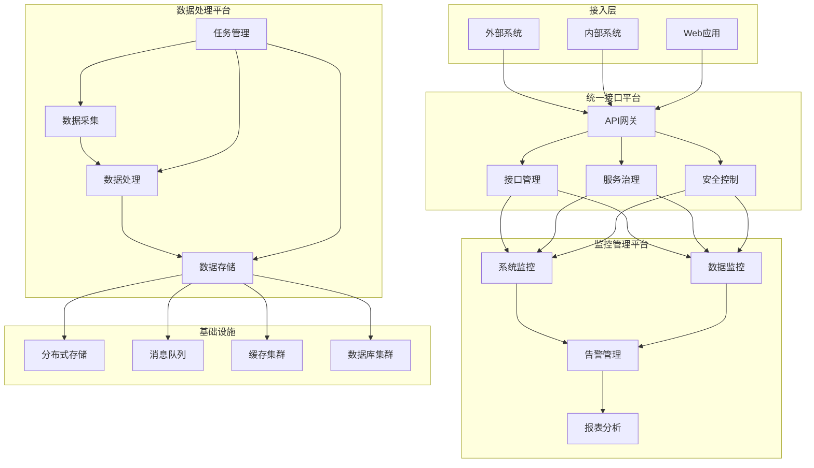

我来帮您设计三个平台的详细需求文档。


# 统一接口与数据管理平台需求规格说明书

## 一、项目背景

### 1.1 现状分析
- 当前系统存在30多个代码模块，40多个大功能，50多个小功能
- 第三方接口调用分散，缺乏统一管理
- 数据采集和校验机制不完善
- 缺乏统一的监控和日志管理
- 系统维护和问题定位困难

### 1.2 痛点问题
1. 接口管理方面
    - 接口分散在各模块，难以统一维护
    - 接口变更时排查困难
    - 缺乏版本控制和变更追踪
    - 接口文档不完善

2. 数据处理方面
    - 数据刷新机制不灵活
    - 缺乏数据一致性校验
    - 数据处理进度无法跟踪
    - 异常情况难以及时发现

3. 系统维护方面
    - 日志分散，问题定位困难
    - 缺乏统一监控平台
    - 业务文档不完善
    - 运维成本高

### 1.3 项目价值
1. 业务价值
    - 提高系统可用性和稳定性
    - 降低运维成本和维护难度
    - 提升数据准确性和时效性
    - 优化业务流程和效率

2. 技术价值
    - 实现技术架构现代化
    - 提升系统可维护性
    - 增强系统可扩展性
    - 提高开发效率

3. 管理价值
    - 提升系统透明度
    - 加强质量控制
    - 优化资源利用
    - 提高决策效率

## 二、详细需求

### 2.1 统一接口平台需求
#### 2.1.1 功能需求
1. 接口管理
    - 接口注册与配置
    - 接口文档管理
    - 接口版本控制
    - 接口变更追踪
    - 接口访问控制
    - 接口参数配置
    - 接口测试工具

2. 服务治理
    - 服务注册发现
    - 负载均衡
    - 流量控制
    - 熔断降级
    - 服务路由

3. 安全控制
    - 访问认证
    - 权限管理
    - 加密传输
    - 审计日志

4. 接口监控
    - 实时监控
    - 性能分析
    - 异常告警
    - 访问统计

#### 2.1.2 非功能需求
1. 性能需求
    - 接口响应时间 < 200ms
    - 系统并发处理能力 > 1000 TPS
    - 系统可用性 > 99.9%

2. 安全需求
    - 支持数据加密传输
    - 实现完整的权限控制
    - 保留操作审计日志

### 2.2 监控管理平台需求
#### 2.2.1 功能需求
1. 系统监控
    - 服务健康状态
    - 系统资源监控
    - 性能指标监控
    - 业务指标监控

2. 数据监控
    - 数据同步状态
    - 数据质量监控
    - 数据处理进度
    - 数据一致性检查

3. 告警管理
    - 告警规则配置
    - 告警级别设置
    - 告警通知方式
    - 告警处理流程

4. 报表分析
    - 系统运行报表
    - 业务分析报表
    - 趋势分析
    - 自定义报表

#### 2.2.2 非功能需求
1. 可用性需求
    - 系统可用性 > 99.9%
    - 支持数据历史查询
    - 支持多维度分析

2. 性能需求
    - 数据刷新延迟 < 1分钟
    - 查询响应时间 < 3秒

### 2.3 数据处理平台需求
#### 2.3.1 功能需求
1. 数据采集
    - 支持多源数据采集
    - 数据格式转换
    - 数据清洗规则
    - 采集任务管理

2. 数据处理
    - 数据验证规则
    - 数据转换规则
    - 数据关联分析
    - 数据质量控制

3. 数据存储
    - 分布式存储
    - 数据备份恢复
    - 存储策略管理
    - 数据生命周期

4. 任务管理
    - 任务调度配置
    - 任务执行控制
    - 任务监控告警
    - 任务日志管理

#### 2.3.2 非功能需求
1. 性能需求
    - 数据处理延迟 < 5分钟
    - 支持增量更新
    - 支持并行处理

2. 可靠性需求
    - 数据不丢失
    - 支持事务处理
    - 具备灾备能力

## 三、系统架构设计




```yaml
# 统一接口平台
api-platform:
  gateway:
    - Spring Cloud Gateway
    - Nacos
    - Sentinel
  security:
    - Spring Security
    - JWT
    - OAuth2
  documentation:
    - Swagger
    - Knife4j
  monitoring:
    - Spring Boot Admin
    - Prometheus
    - Grafana

# 监控管理平台
monitoring-platform:
  apm:
    - SkyWalking
    - Pinpoint
  metrics:
    - Prometheus
    - Grafana
  logging:
    - ELK Stack
    - Filebeat
  alerting:
    - AlertManager
    - DingTalk/WeChat Integration

# 数据处理平台
data-platform:
  collection:
    - Apache Sqoop
    - Logstash
    - Flume
  processing:
    - Spring Batch
    - Apache Spark
    - Apache Flink
  storage:
    - MySQL
    - MongoDB
    - Elasticsearch
  scheduling:
    - XXL-Job
    - Apache Airflow

# 基础设施
infrastructure:
  container:
    - Docker
    - Kubernetes
  message-queue:
    - RocketMQ
    - Kafka
  cache:
    - Redis Cluster
  storage:
    - MinIO
    - Ceph

```

关键实施建议：

1. 分步实施策略
```
第一阶段（1-2个月）：
- 搭建基础设施
- 部署核心组件
- 实现基础功能

第二阶段（2-3个月）：
- 开发统一接口平台
- 实现接口管理功能
- 配置安全控制

第三阶段（2-3个月）：
- 开发监控管理平台
- 实现告警系统
- 配置监控指标

第四阶段（2-3个月）：
- 开发数据处理平台
- 实现数据采集和处理
- 完善任务管理
```

2. 风险防控措施
```
- 做好数据备份
- 实现灰度发布
- 制定回滚方案
- 建立应急预案
```

3. 质量保证措施
```
- 制定测试计划
- 执行性能测试
- 进行安全审计
- 进行代码审查
```

这个方案综合考虑了系统现状和未来需求，通过三个平台的建设来解决当前存在的问题。您觉得这个方案是否符合预期？如果需要，我们可以针对某个具体平台进行更详细的设计讨论。