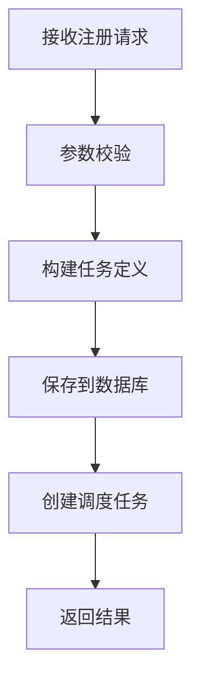
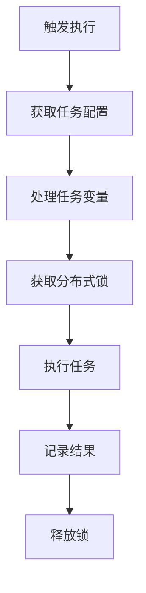
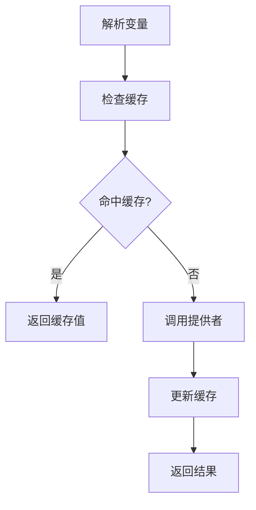
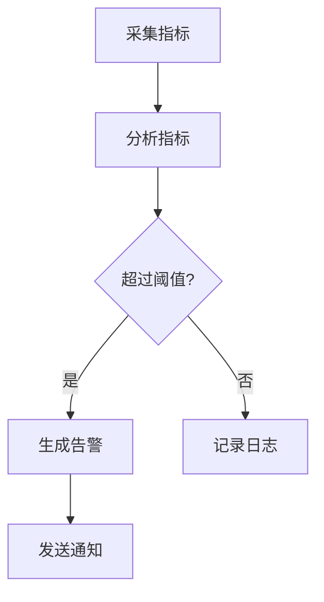

# 调度系统完整项目结构

## 一、核心需求

### 1. 任务管理
- 通过API注册定时任务到数据库
- 支持CRON表达式和固定延迟调度
- 支持HTTP、Shell等多种任务类型
- 任务可配置超时时间和重试策略

### 2. 变量管理
- 支持任务配置中的变量替换
- 提供变量提供者机制(如Token获取)
- 支持动态参数构造(如版本获取)
- 变量缓存和刷新机制

### 3. 执行控制
- 分布式任务调度和执行
- 任务分片和负载均衡
- 支持单次执行和批量执行
- 执行状态跟踪和日志记录

### 4. 监控告警
- 任务执行监控和统计
- 系统资源监控
- 异常情况告警
- 运行报表生成
## 二、业务流程

### 1. 任务注册流程


### 2. 任务执行流程


### 3. 变量处理流程


### 4. 监控告警流程


## 三、架构设计

### 1. 项目分层
```
应用层(API) -> 业务层(Service) -> 领域层(Domain) -> 基础设施层(Infrastructure)
```

### 2. 核心模块

#### 2.1 任务管理模块
```java
// 任务注册
@PostMapping("/jobs")
public Result registerJob(@RequestBody JobRegisterRequest request) {
    // 1. 参数校验
    validateRequest(request);
    
    // 2. 构建任务
    JobDefinition jobDef = buildJobDefinition(request);
    
    // 3. 保存任务
    jobService.saveJob(jobDef);
    
    // 4. 创建调度
    schedulerService.scheduleJob(jobDef);
    
    return Result.success();
}

// 任务执行
@PostMapping("/jobs/{id}/execute")
public Result executeJob(@PathVariable("id") String jobId,
        @RequestBody JobExecuteRequest request) {
    // 1. 获取任务
    JobDefinition jobDef = jobService.getJob(jobId);
    
    // 2. 处理变量
    JobContext context = createContext(jobDef, request);
    
    // 3. 执行任务
    executionService.executeJob(context);
    
    return Result.success();
}
```

#### 2.2 变量管理模块
```java
@Component
public class VariableManager {
    @Autowired
    private List<VariableProvider> providers;
    
    public String resolveVariable(String var, JobContext context) {
        // 1. 查找提供者
        VariableProvider provider = findProvider(var);
        
        // 2. 获取变量值
        String value = provider.getValue(var, context);
        
        // 3. 缓存结果
        cacheValue(var, value);
        
        return value;
    }
}

// Token提供者示例
@Component 
public class TokenProvider implements VariableProvider {
    @Override
    public String getType() {
        return "token";
    }
    
    @Override
    public String getValue(String key, JobContext context) {
        // 1. 检查缓存
        String token = getFromCache(key);
        if(token != null) {
            return token;
        }
        
        // 2. 获取新token
        token = requestNewToken(key);
        
        // 3. 更新缓存
        updateCache(key, token);
        
        return token;
    }
}
```

#### 2.3 执行调度模块
```java
@Service
public class ExecutionService {
    @Autowired 
    private DistributedLock lock;
    
    @Autowired
    private JobExecutor executor;
    
    public void executeJob(JobContext context) {
        String lockKey = getLockKey(context);
        
        try {
            // 1. 获取锁
            if(!lock.tryLock(lockKey)) {
                throw new JobException("Job is running");
            }
            
            // 2. 执行任务
            ExecuteResult result = executor.execute(context);
            
            // 3. 处理结果
            handleResult(result);
            
        } finally {
            // 4. 释放锁
            lock.unlock(lockKey);
        }
    }
}
```

#### 2.4 监控告警模块
```java
@Service
public class MonitorService {
    @Autowired
    private AlertManager alertManager;
    
    @Scheduled(fixedRate = 60000)
    public void monitor() {
        // 1. 采集指标
        List<MetricsRecord> metrics = collectMetrics();
        
        // 2. 分析指标
        List<Alert> alerts = analyzeMetrics(metrics);
        
        // 3. 处理告警
        for(Alert alert : alerts) {
            alertManager.handleAlert(alert);
        } 
    }
}
```

## 四、结构分析

## 五、完整项目结构

```
platform-scheduler/
├── api/                                    # API层: 接口与模型定义
│   ├── controller/                         
│   │   ├── job/                           # 任务控制器
│   │   │   ├── JobController.java         # 基础任务操作(CRUD)
│   │   │   ├── JobRegisterController.java # 任务注册与配置
│   │   │   ├── JobExecuteController.java  # 任务执行控制
│   │   │   └── JobTemplateController.java # 任务模板管理
│   │   ├── monitor/                       
│   │   │   ├── MetricsController.java     # 指标监控接口
│   │   │   └── AlertController.java       # 告警管理接口
│   │   └── admin/                        
│   │       └── SystemController.java      # 系统管理接口
│   └── model/                             
      ├── request/                         # 请求对象
      │   ├── job/
      │   │   ├── JobCreateRequest.java    # 创建任务请求
      │   │   ├── JobUpdateRequest.java    # 更新任务请求
      │   │   ├── JobQueryRequest.java     # 查询任务请求
      │   │   ├── JobRegisterRequest.java  # 注册任务请求
      │   │   ├── JobExecuteRequest.java   # 执行任务请求
      │   │   └── BatchJobRequest.java     # 批量任务请求
      │   └── monitor/
      │       ├── AlertRequest.java        # 告警请求
      │       └── MetricsRequest.java      # 指标请求
      └── vo/                              # 视图对象  
          ├── job/
          │   ├── JobVO.java              # 任务视图
          │   ├── JobDetailVO.java        # 任务详情视图
          │   └── JobLogVO.java           # 任务日志视图
          └── monitor/
              ├── MetricsVO.java          # 指标视图
              └── AlertVO.java            # 告警视图

├── core/                                  # 核心层: 核心业务逻辑实现
│   ├── executor/                         # 执行器
│   │   ├── JobExecutor.java             # 执行器接口
│   │   ├── DefaultJobExecutor.java      # 默认执行器实现
│   │   ├── HttpJobExecutor.java         # HTTP任务执行器
│   │   ├── ShellJobExecutor.java        # Shell任务执行器
│   │   └── BatchJobExecutor.java        # 批量任务执行器
│   ├── scheduler/                        # 调度器
│   │   ├── JobScheduler.java            # 调度器接口
│   │   └── QuartzJobScheduler.java      # Quartz实现
│   ├── handler/                          # 处理器
│   │   ├── VariableHandler.java         # 变量处理
│   │   └── ParamHandler.java            # 参数处理
│   └── manager/                          # 管理器
│       ├── JobManager.java              # 任务管理
│       └── ExecutionManager.java        # 执行管理

├── domain/                               # 领域层: 业务实体与核心逻辑
│   ├── entity/                          # 实体
│   │   ├── job/
│   │   │   ├── JobDefinition.java      # 任务定义
│   │   │   ├── JobExecution.java       # 任务执行
│   │   │   ├── JobTemplate.java        # 任务模板
│   │   │   └── JobLog.java             # 任务日志
│   │   └── monitor/
│   │       ├── MetricsRecord.java      # 指标记录
│   │       └── AlertRecord.java        # 告警记录
│   ├── repository/                      # 仓储接口
│   │   ├── JobRepository.java          # 任务仓储
│   │   └── ExecutionRepository.java    # 执行仓储
│   └── service/                         # 领域服务
│       ├── JobDomainService.java       # 任务领域服务
│       └── ExecutionDomainService.java # 执行领域服务

├── infra/                               # 基础设施层: 技术实现
│   ├── config/                          # 配置类
│   │   ├── QuartzConfig.java          # Quartz配置
│   │   ├── RedisConfig.java           # Redis配置
│   │   ├── RabbitConfig.java          # RabbitMQ配置
│   │   ├── DatabaseConfig.java        # 数据库配置
│   │   └── ThreadPoolConfig.java      # 线程池配置
│   ├── persistence/                    # 持久化实现
│   │   ├── mysql/                     # MySQL实现
│   │   │   ├── mapper/               # MyBatis映射器
│   │   │   │   ├── JobMapper.java
│   │   │   │   └── ExecutionMapper.java
│   │   │   └── entity/              # 数据库实体
│   │   │       ├── JobDO.java
│   │   │       └── ExecutionDO.java
│   │   ├── redis/                    # Redis实现
│   │   │   ├── RedisRepository.java  # Redis仓储
│   │   │   └── RedisCache.java       # Redis缓存
│   │   └── repository/               # 仓储实现
│   │       ├── JobRepositoryImpl.java
│   │       └── ExecutionRepositoryImpl.java
│   ├── mq/                           # 消息队列
│   │   ├── rabbit/                   # RabbitMQ实现
│   │   │   ├── config/              # RabbitMQ配置
│   │   │   │   └── RabbitConstants.java
│   │   │   ├── producer/           # 生产者
│   │   │   │   ├── JobProducer.java
│   │   │   │   └── AlertProducer.java
│   │   │   └── consumer/           # 消费者
│   │   │       ├── JobConsumer.java
│   │   │       └── AlertConsumer.java
│   │   └── message/                # 消息定义
│   │       ├── JobMessage.java
│   │       └── AlertMessage.java
│   └── lock/                      # 分布式锁
│       ├── DistributedLock.java  # 锁接口
│       └── RedisLock.java        # Redis实现

├── extension/                    # 扩展功能层: 扩展功能实现
│   ├── variable/                # 变量管理
│   │   ├── provider/           # 变量提供者
│   │   │   ├── TokenProvider.java    # Token提供者
│   │   │   ├── VersionProvider.java  # 版本提供者
│   │   │   └── AbstractProvider.java # 提供者抽象类
│   │   ├── resolver/           # 变量解析
│   │   │   ├── VariableResolver.java # 变量解析器
│   │   │   └── ExpressionParser.java # 表达式解析器
│   │   └── manager/            # 变量管理
│   │       └── VariableManager.java  # 变量管理器
│   ├── template/               # 模板管理
│   │   ├── TaskTemplate.java  # 任务模板
│   │   ├── TemplateEngine.java # 模板引擎
│   │   └── TemplateParser.java # 模板解析器
│   └── batch/                  # 批量任务
│       ├── BatchTaskCreator.java # 批量任务创建器
│       └── BatchTaskExecutor.java # 批量任务执行器

└── common/                      # 公共模块: 通用功能
    ├── constant/               # 常量定义
    │   ├── JobConstant.java   # 任务常量
    │   ├── MqConstant.java    # MQ常量
    │   └── SystemConstant.java # 系统常量
    ├── utils/                  # 工具类
    │   ├── JsonUtils.java     # JSON工具
    │   ├── DateUtils.java     # 日期工具
    │   └── LockUtils.java     # 锁工具
    └── exception/             # 异常定义
        ├── JobException.java  # 任务异常
        └── SystemException.java # 系统异常
```

## 六、核心中间件支持说明

### 1. Redis支持
- RedisConfig: Redis连接配置
- RedisCache: 缓存实现
- RedisLock: 分布式锁实现
- RedisRepository: Redis存储实现
- 变量缓存

### 2. RabbitMQ支持
- RabbitConfig: RabbitMQ连接配置
- JobProducer: 任务消息生产者
- JobConsumer: 任务消息消费者
- MessageConverter: 消息转换器
- 任务分发
- 执行结果回调
- 告警通知

### 3. MySQL支持
- DatabaseConfig: 数据源配置
- MyBatis映射器
- 数据库实体对象
- 事务管理
- 任务元数据
- 执行记录
- 监控数据

## 七、关键设计点

### 1. 高可用
- 服务无状态设计
- 任务分片执行
- 失败自动重试
- 节点故障转移

### 2. 可扩展
- 插件化任务类型
- 灵活变量提供者
- 多样告警通道
- 任务模板机制

### 3. 可维护
- 完整日志记录
- 清晰任务链路
- 统一异常处理
- 标准接口规范

### 八、扩展性设计

1. 变量提供者扩展
```java
// AbstractProvider.java
public abstract class AbstractProvider implements VariableProvider {
    public abstract String getType();
    public abstract String getValue(String key);
}

// 实现示例
@Component
public class TokenProvider extends AbstractProvider {
    @Override
    public String getType() {
        return "token";
    }
    
    @Override
    public String getValue(String key) {
        // 实现token获取逻辑
    }
}
```

2. 任务执行器扩展
```java
// JobExecutor.java
public interface JobExecutor {
    String getType();
    ExecuteResult execute(JobContext context);
}

// 实现示例
@Component
public class HttpJobExecutor implements JobExecutor {
    @Override
    public String getType() {
        return "HTTP";
    }
    
    @Override
    public ExecuteResult execute(JobContext context) {
        // 实现HTTP任务执行逻辑
    }
}
```
