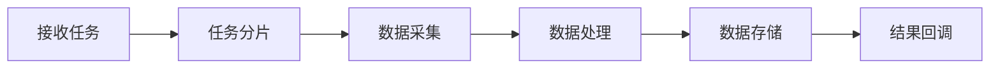

# 分布式数据采集平台架构设计

## 一、系统概述

### 1.1 设计目标
- 构建可扩展的数据采集基础框架
- 支持多样化的数据采集场景
- 确保采集任务的可靠性和性能
- 提供灵活的业务扩展机制

### 1.2 技术栈选型
- 基础框架: Spring Boot 3.2.9
- 数据存储: MongoDB + Redis
- 消息队列: RabbitMQ
- 任务调度: Quartz
- 监控告警: Prometheus + Grafana

### 1.3 核心特性
- 多种采集模式支持
- 分布式任务调度
- 实时数据处理
- 高可用架构设计
- 可扩展业务框架

## 二、架构设计

### 2.1 系统分层
```
platform-collect/
├── api/                 # API层: 对外接口和协议适配
├── core/                # 核心层: 业务核心逻辑实现
├── domain/             # 领域层: 领域模型和规则
├── infrastructure/     # 基础设施层: 技术组件适配
└── common/            # 公共层: 工具与通用定义
```

### 2.2 核心组件

#### 2.2.1 采集引擎
```java
public interface CollectEngine {
    // 启动采集任务
    void startCollect(CollectTask task);
    
    // 停止采集任务
    void stopCollect(String taskId);
    
    // 获取采集状态
    CollectStatus getStatus(String taskId);
}

public abstract class AbstractCollectEngine implements CollectEngine {
    protected CollectorFactory collectorFactory;
    protected ProcessorChain processorChain;
    protected TaskScheduler taskScheduler;
    
    // 模板方法定义采集流程
    protected void doCollect(CollectTask task) {
        // 1. 任务预处理
        preProcess(task);
        
        // 2. 执行采集
        Collector collector = collectorFactory.getCollector(task.getType());
        CollectResult result = collector.collect(task);
        
        // 3. 数据处理
        processorChain.process(result);
        
        // 4. 结果处理
        postProcess(result);
    }
}
```

#### 2.2.2 处理器链
```java
public interface Processor {
    void process(ProcessContext context);
    int getOrder();
}

public class ProcessorChain {
    private List<Processor> processors;
    
    public void process(ProcessContext context) {
        processors.stream()
            .sorted(Comparator.comparing(Processor::getOrder))
            .forEach(processor -> processor.process(context));
    }
}

// 处理器示例
@Component
public class DataValidateProcessor implements Processor {
    @Override
    public void process(ProcessContext context) {
        // 数据校验逻辑
    }
}
```

#### 2.2.3 任务调度
```java
public interface TaskScheduler {
    // 提交任务
    void submit(CollectTask task);
    
    // 取消任务
    void cancel(String taskId);
    
    // 任务分片
    List<SubTask> split(CollectTask task);
}

public class DistributedTaskScheduler implements TaskScheduler {
    @Autowired
    private TaskSplitStrategy splitStrategy;
    
    @Autowired
    private LoadBalanceStrategy loadBalanceStrategy;
    
    @Override
    public void submit(CollectTask task) {
        // 1. 任务分片
        List<SubTask> subTasks = splitStrategy.split(task);
        
        // 2. 分片分发
        subTasks.forEach(subTask -> {
            String node = loadBalanceStrategy.select();
            dispatch(node, subTask);
        });
    }
}
```

### 2.3 数据流转

#### 2.3.1 采集流程


#### 2.3.2 处理链路
```java
// 处理器上下文
public class ProcessContext {
    private CollectTask task;
    private CollectResult result;
    private Map<String, Object> attributes;
}

// 处理器链构建
@Configuration
public class ProcessorConfig {
    @Bean
    public ProcessorChain processorChain(List<Processor> processors) {
        ProcessorChain chain = new ProcessorChain();
        chain.setProcessors(processors);
        return chain;
    }
}
```

## 三、扩展机制

### 3.1 业务扩展

#### 3.1.1 简单扩展
```java
// 继承基础采集器
public class CustomCollector extends AbstractCollector {
    @Override
    protected CollectResult doCollect(CollectContext context) {
        // 实现采集逻辑
        return result;
    }
}

// 注册到工厂
@Component
public class CustomCollectorFactory implements CollectorFactory {
    @Override
    public Collector createCollector(String type) {
        if ("custom".equals(type)) {
            return new CustomCollector();
        }
        return null;
    }
}
```

#### 3.1.2 完全自定义
```java
// 自定义采集引擎
public class CustomCollectEngine implements CollectEngine {
    // 完全自定义实现
}

// 配置加载
@Configuration
public class CustomConfig {
    @Bean
    public CollectEngine customEngine() {
        return new CustomCollectEngine();
    }
}
```

### 3.2 组件扩展

#### 3.2.1 存储扩展
```java
// 自定义存储实现
public class CustomStorage implements DataStorage {
    @Override
    public void save(CollectData data) {
        // 存储实现
    }
}

// 注册配置
@Configuration
public class StorageConfig {
    @Bean
    public DataStorage customStorage() {
        return new CustomStorage();
    }
}
```

#### 3.2.2 处理器扩展
```java
@Component
public class CustomProcessor implements Processor {
    @Override
    public void process(ProcessContext context) {
        // 处理逻辑
    }
    
    @Override
    public int getOrder() {
        return 100;
    }
}
```

## 四、部署架构

### 4.1 系统部署
```
采集集群:
    - 采集节点 x N
    - 调度节点 x 2
    - 管理节点 x 2

存储集群:
    - MongoDB分片集群
    - Redis集群
    - RabbitMQ集群

监控系统:
    - Prometheus
    - Grafana
    - AlertManager
```

### 4.2 高可用方案

#### 4.2.1 服务高可用
- 多节点部署
- 服务自动发现
- 故障自动转移
- 任务动态分配

#### 4.2.2 数据高可用
- 数据多副本
- 分片存储
- 异步复制
- 数据一致性保证

## 五、安全设计

### 5.1 接入安全
- 接口认证授权
- 数据传输加密
- 敏感信息脱敏
- 访问控制策略

### 5.2 数据安全
- 数据加密存储
- 备份恢复机制
- 审计日志记录
- 数据生命周期管理

## 六、监控运维

### 6.1 监控指标
```java
@Component
public class CollectMetrics {
    private final Counter collectCounter;
    private final Gauge activeTaskGauge;
    private final Histogram processTimeHistogram;
    
    // 采集任务计数
    public void incrementCollectCount() {
        collectCounter.increment();
    }
    
    // 更新活跃任务数
    public void updateActiveTask(long count) {
        activeTaskGauge.set(count);
    }
    
    // 记录处理时间
    public void recordProcessTime(long time) {
        processTimeHistogram.record(time);
    }
}
```

### 6.2 告警规则
```yaml
rules:
  - alert: HighErrorRate
    expr: collect_error_total / collect_total > 0.1
    for: 5m
    labels:
      severity: critical
    annotations:
      summary: High collect error rate
      
  - alert: SlowProcess
    expr: collect_process_time_bucket{le="30.0"} < 0.95
    for: 5m
    labels:
      severity: warning
```

## 七、性能优化

### 7.1 采集优化
- 动态分片策略
- 批量处理机制
- 并发度控制
- 资源复用

### 7.2 存储优化
- 索引优化
- 分片策略
- 缓存设计
- 批量操作

## 八、开发规范

### 8.1 代码规范
- 遵循阿里巴巴Java开发规范
- 统一异常处理
- 规范注释文档
- 单元测试覆盖

### 8.2 设计规范
- 接口隔离原则
- 依赖倒置原则
- 组合优于继承
- 面向接口编程

## 九、版本规划

### 9.1 近期规划
- 支持更多数据源
- 优化任务调度
- 增强监控能力
- 提升系统性能

### 9.2 长期规划
- 微服务架构演进
- 云原生化改造
- 智能化调度
- 平台生态建设
